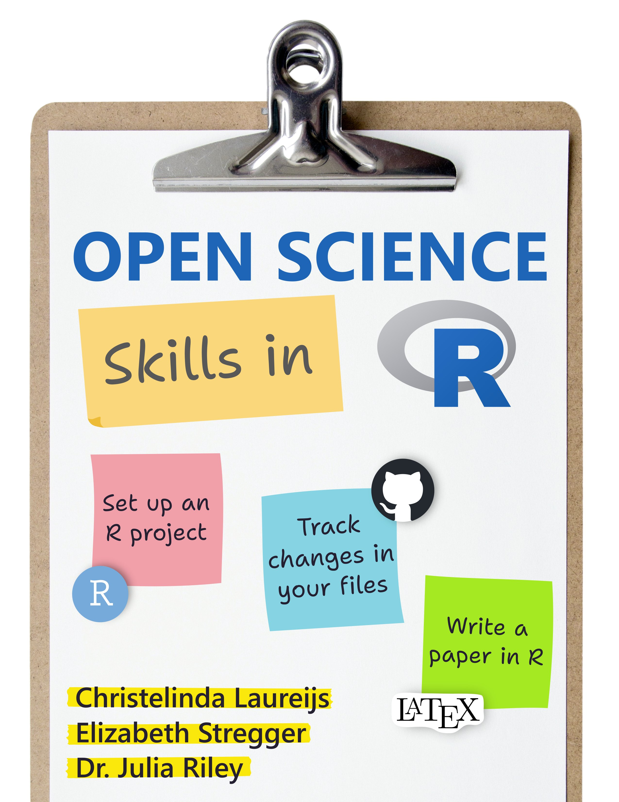

# Open Science Skills in R

Learning to use R is an important step to help you contribute to open science. We created this book as part of a workshop about Open Science Skills in R, and also to provide you with support after the workshop is over.

This book contains chapters for the following topics:

* Introducing you to R and helping you get R, RStudio, LaTeX and necessary packages installed
* Walking you through how to set up Git and GitHub on your computer to track changes in your files and manage collaborations
* Demonstrating tips and tricks for writing papers entirely in R (no copying and pasting between platforms!)

