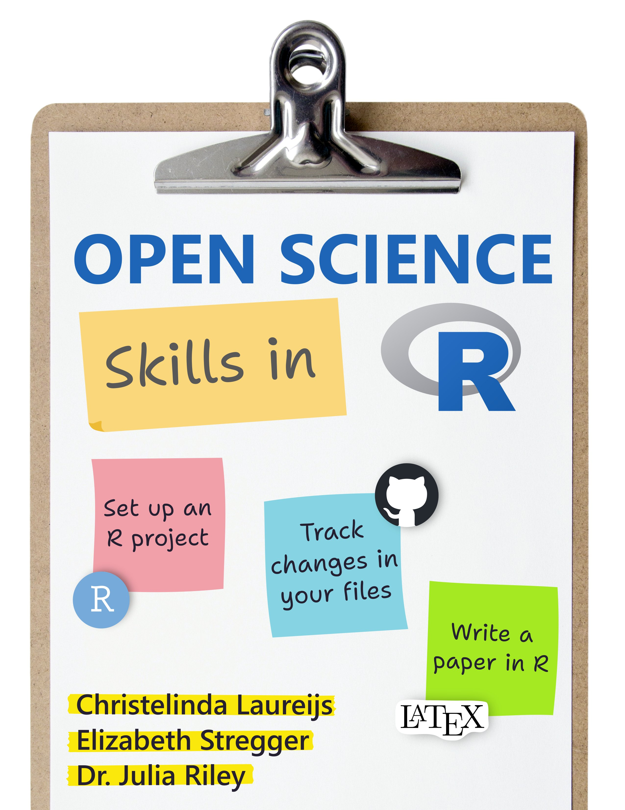

--- 
title: "Open Science Skills in R"
author: "Christelinda Laureijs, Elizabeth Stregger, Dr. Julia Riley"
date: "January 18, 2025"
site: bookdown::bookdown_site
documentclass: book
bibliography: [book.bib, packages.bib]
# url: your book url like https://bookdown.org/yihui/bookdown
cover-image: images/cover.jpg
description: |
  This book is a resource developed to complement the Open Science Skills in R workshop series.
---

# Introduction {-}

This book is part of a 3-part workshop series led by Christelinda Laureijs, Elizabeth Stregger, and Dr. Julia Riley. We are a group of enthusiastic R coders with a passion for open science and educational outreach! We created this book for three reasons:

1. To provide you with a useful resource after the workshop series is over.
2. To give a quick overview to anyone who wants to get started with setting up R, managing their projects, and writing papers with R.
3. To gather tips, tricks and links to other resources all in one document.

This book is divided into three chapters associated with each workshop:

**1. Welcome and Introducing a Tidy Workflow**

These skills will help in with organization for your research project,
collaborations, and ensuring transparency and broad impact.

* How to set up R, RStudio, LaTeX and required packages
* Tidy projects and data management strategies
* Tidy coding practices
* Organizing your research project

**2. Git with it**

After this section, you'll have an understanding of how you can track changes
with Git, share your work with GitHub, reuse open code, and contribute to open
projects.

* Setting up Git on your computer
* Creating a repository
* Tracking changes to your project
* Exploring the history of a project
* Collaborating in GitHub

**3. Reproducible Scientific Writing with R**

All the skills from the previous chapters come together in this last section.
You will learn how to write a paper completely within R - no more copying and
pasting between different platforms!

* Creating publication-ready figures and tables
* Managing citations
* Organizing a paper into chapters
* Customizing your paper
* Extract statistical values to insert directly into the paper

# Quick introduction to open science  {-}

You might be wondering: **what is open science?** It is the process of making the content and process of producing evidence and claims transparent and accessible to others. This involves making the entire research process - from project conceptualization to publication - open to all and transparent. There are a number of techniques that you can work on to improve transparency and reproducibility (the ability to repeat the same project and obtain the same results) of your work. In this workshop series, we will be covering a few skills that will help you advance science using open practices.

We don't have too much time to review the importance of open science practices and its philosophy in this workshop series, because we are focusing on skill building. **But, we encourage you to learn more through reading and engaging with additional resources on this topic. Here are a few we find helpful:**

* [A Manifesto for Reproducible Science by Munafò et al. 2017](https://www.nature.com/articles/s41562-016-0021)

* Today we will not be talking about preregistration, which is simply specifying your research plan in advance of your study and submitting it to a registry. This is a important first step of a research project that adheres to open science practice. For more details, check out [this website.](https://www.cos.io/initiatives/prereg?_ga=2.263330764.1195627208.1585935801-1853960792.1572623623.)

* [The Center for Open Science](https://www.cos.io/open-science) also has a number of useful resources, and they also host their own repsoitory where data, etc. can be hosted and shared with others called the [Open Science Framework](https://osf.io/)
